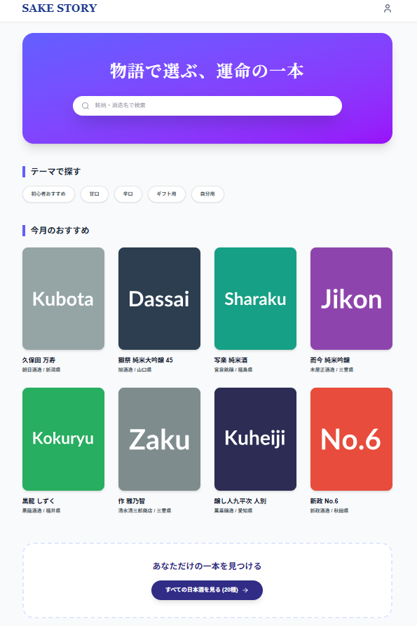
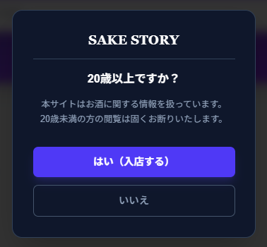
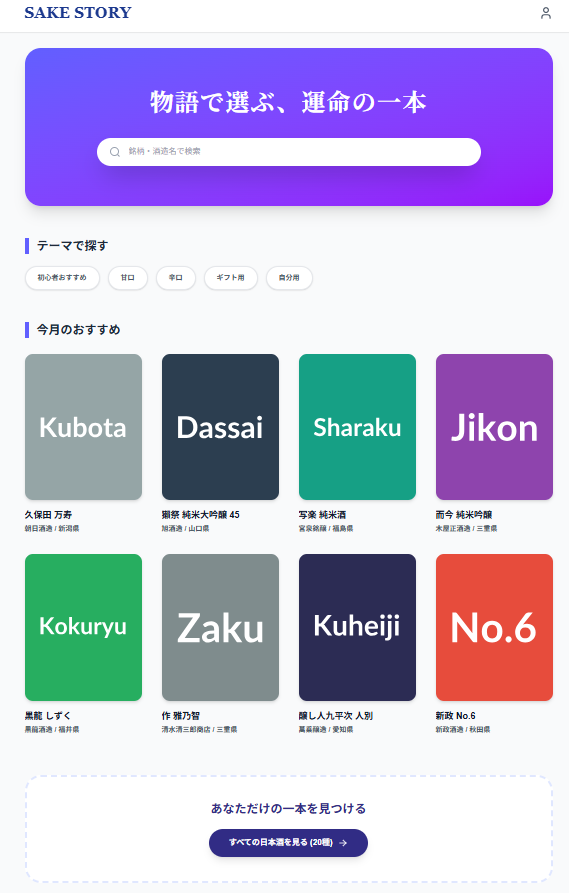
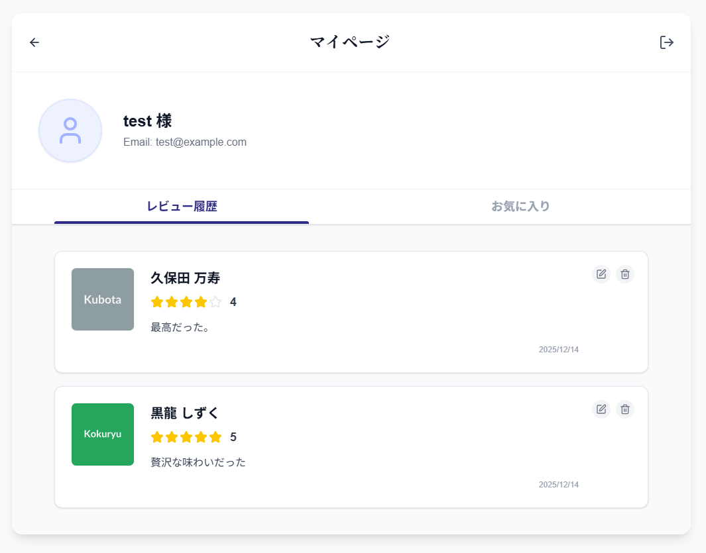
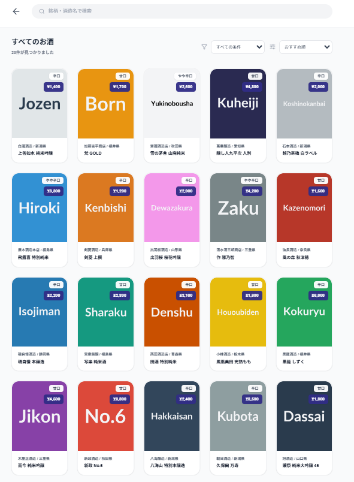
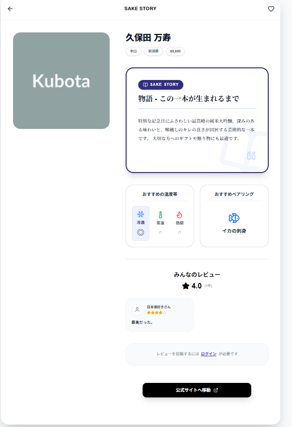
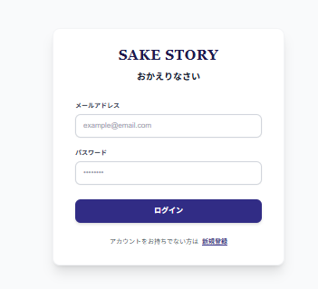
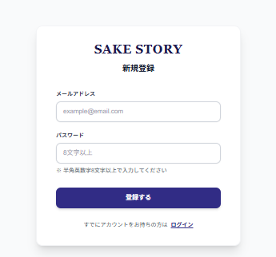

# SAKE STORY - 日本酒にストーリーを添えて、あなたに合った一本と出会う -



## コンセプト
**「スペックではなく、物語で選ぶ」**
SAKE STORYは、日本酒の基本情報だけでなく、そのお酒が生まれた背景や蔵元の想い（ストーリー）を軸に、
日本酒に詳しくない人から愛好者まで、年齢問わず「自分に合う1本」や「贈り物として喜ばれる1本」と出会えるマッチングプラットフォームです。

### ターゲット層
* **20代〜80代**の幅広い層
* 自分用に新しい日本酒を開拓したい方
* 大切な人への失敗しない贈り物（ギフト）を探している方

## 開発の背景 
**「デジタルの『ぽんしゅ館』を作りたい」**
私の地元・新潟には、多種多様な日本酒を気軽に試飲できる「ぽんしゅ館」という施設があります。そこで偶然出会った一杯に感動した経験が、このアプリの原点です。
物理的な距離に関わらず、オンライン上でも「自分の好みに合った予期せぬ一本」と出会える環境を作りたいと考え、開発に至りました。

## 課題と解決策
| 現状の課題 | SAKE STORYの解決策 |
| **種類が多すぎて選べない** | 独自のフィルタ機能とレコメンドにより、膨大な選択肢から最適な一本を提示します。|
| **ギフト/自分用の選び分けが困難** | 利用シーン（ギフト用/自分用）による絞り込みと、ストーリー情報による「語れる付加価値」を提供します。|
| **レビューが分散している** | サイト内レビュー機能により、実際の飲用者の声を一元管理し、比較検討しやすくします。|

## 利用フロー
1. **年齢確認**: 初回アクセス時に年齢確認を実施（20歳未満の利用防止）。
2. **検索・フィルタ**:「甘口/辛口」「ギフト用/自分用」などの条件で絞り込み。
3. **ストーリー体験**: 商品詳細ページにて、スペックだけでなく「誕生秘話」や「おすすめの飲み方」を閲覧。
4. **選定・購入**: 気に入った商品は、メーカー公式サイト等の購入ページへ遷移
> ※アプリ内決済は非保持。公式サイトがない銘柄は「銘柄名 + 購入」でGoogle検索結果へ遷移させ、購入機会を損失させない工夫をしています。
5. **体験の共有**: 飲んだ感想をレビューとして投稿し、他のユーザーへ共有。

## デモ
* **アプリURL:** [https://あなたのデモURL.vercel.app](https://sake-story.vercel.app/)

### 動作確認用アカウント
ログイン機能確認用のアカウントです。
| **Email** | test2@example.com|
| **Password** | 20251222 |

## スクリーンショット

| 年齢確認 | トップページ | マイページ |
| :---: | :---: | :---: |
|  |  |  |

| 銘柄詳細 | ログイン | 新規登録 | 一覧 |
| :---: | :---: | :---: | :---: |
|  |  |  |  |

## 機能一覧 
### 実装済み機能
* **認証機能**: ユーザー登録、ログイン、ログアウト
* **年齢確認**: 初回利用時のモーダル確認
* **商品検索**: キーワード検索、詳細フィルタ（甘辛、産地、価格帯、利用シーン等）
* **詳細表示**: 基本情報（味、ペアリング、地域）＋ ストーリー表示
* **レビュー機能**: 評価（★）とコメントの投稿・閲覧
* **お気に入り機能**: 気になる銘柄の保存
* **外部連携**: 蔵元/販売サイトへの遷移ボタン <br>(公式サイトがない場合、「銘柄名 + 購入」などのキーワードでGoogle検索した結果ページに遷移)

### 実装予定機能
サービスの価値向上と、大規模トラフィックに耐えうるインフラ構築を目指し、以下のアップデートを計画しています。
### 機能面の拡張
* **レコメンド機能の強化**
    * ユーザーの閲覧履歴やお気に入りデータに基づき、好みに近い銘柄を提案するアルゴリズムの実装。
* **最近見た商品リスト**
    * 比較検討をスムーズにするため、閲覧履歴の保存・表示機能。
* **SNSシェア機能**
    * お気に入りの銘柄やストーリーを、魅力的なカード形式でX（旧Twitter）やInstagramへシェアできる機能。
* **多言語対応**
    * 昨今の日本酒の世界的なブームやインバウンド需要を見据え、英語等への切り替え機能を実装し、海外ユーザーへのアプローチを行う。

### インフラ・技術スタックの刷新
* **AWS版への移行とリリース**
    * 現在は開発スピードを重視しSupabase（BaaS）を採用していますが、将来的なスケーラビリティの確保と、より細かいセキュリティ要件に対応するため、AWSへの移行を予定しています。
    * **想定構成:** ECS  / Cognito / S3 等

### やらないこと
* **EC機能（決済・在庫管理）**: 本アプリは「出会い」に特化するため、販売は既存のECサイトへ送客する形をとっています。

## 🛠 使用技術 (Technology)
### フロントエンド
* **Framework:** Next.js 16.0 (App Router)
* **Language:** TypeScript 5.x
* **Library:** React 19.2
* **Styling:** Tailwind CSS 4.x / tailwind-merge / clsx
* **State:** React Hooks

### バックエンド / インフラ
* **BaaS:** Supabase (PostgreSQL, @supabase/supabase-js v2.87)
* **Deploy:** Vercel

##  ディレクトリ構成

```text
SAKE-STORY/
├── app/                      # App Router：メインロジック
│   ├── lib/                  # 共通処理（supabaseClient.js 等）
│   ├── list/                 # 銘柄一覧画面
│   │   └── [id]/             # 銘柄詳細画面（動的ルーティング）
│   ├── login/                # ログイン画面
│   ├── mypage/               # マイページ画面
│   └── signup/               # 新規登録画面
├── docs/                     # ドキュメント資料
│   └── images/               # README用スクリーンショット
├── public/                   # 静的アセット（画像・アイコン）
├── .env.local                # 環境変数（Git管理外）
├── next.config.ts            # Next.js基本設定
├── package.json              # 依存関係管理
└── README.md                 # プロジェクト説明書


### 開発環境 (Requirements)
* Node.js v22.21.0
* npm v10.9.4

## 環境構築 
ローカル環境で実行するための手順です。

```bash
# 1. リポジトリをクローン
git clone [https://github.com/あなたのユーザー名/sake-story.git](https://github.com/あなたのユーザー名/sake-story.git)

# 2. ディレクトリへ移動
cd C:\Users\USER\sake-story

# 3. パッケージのインストール
npm install

# 4. 環境変数の設定
# .env.localファイルを作成し、Supabaseのキー等を設定。
#NEXT_PUBLIC_SUPABASE_URL=https://oewvuzcrtvakpmvoxsak.supabase.co
#NEXT_PUBLIC_SUPABASE_ANON_KEY=sb_publishable_uRKCxakFYYjVy3u-kfnQQA_7KFKOvoh

# 5. ローカルサーバーの起動
npm run dev
